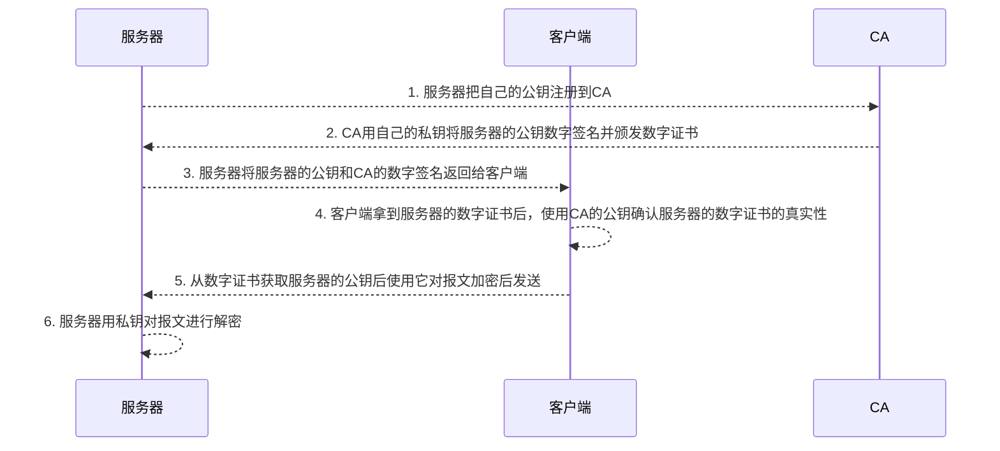

## HTTP 是什么？
HTTP 是超文本传输协议，也就是HyperText Transfer Protocol。`HTTP 是一个在计算机世界里专门在「两点」之间「传输」文字、图片、音频、视频等「超文本」数据的「约定和规范」。`  

##常见的状态码有哪些？
`1xx` 属于提示信息
`2xx` 表示服务器成功处理了客户端的请求
`3xx` 表示重定向「301 Moved Permanently」表示永久重定向/「302 Found」表示临时重定向 / 「304 Not Modified」
`4xx` 表示客户端发送的报文有误，服务器无法处理 「400 Bad Request」/「403 Forbidden」/ 「404 Not Found」
`5xx` 服务器处理时内部发生了错误 「500 Internal Server Error」/ 「502 Bad Gateway」/ 「503 Service Unavailable」

##常见字段有哪些？
请求字段:Accept/ Accept-Encoding / Accept-Language / Authorization / Cache-Control / Connection / Content-Length / Content-Type / Cookie / Host / Origin / Refer / User-Agent
响应字段：Access-Control-Allow-Origin / Cache-Control / Content-Encoding / Content-Length / Content-Type / Date / ETag / Expires / Last-Modified / Location / Server / Set-Cookie 

##`GET`和`POST`的区别
**用途**：GET获取资源，POST提交信息
**参数传递**：GET在URL上长度受限，POST通过body基本不受限
**缓存**：GET可配缓存，POST不可以
**幂等性**：GET幂等，POST不幂等；GET相对服务器安全
`GET` 的语义是请求获取指定的资源。GET 方法是安全、幂等、可被缓存的。
`POST` 的语义是根据请求负荷（报文主体）对指定的资源做出处理，具体的处理方式视资源类型而不同。POST 不安全，不幂等，（大部分实现）不可缓存。

##HTTP缓存
HTTP 缓存有两种实现方式，分别是**强制缓存**和**协商缓存**。
`强制缓存`: 缓存没有过期，则直接使用浏览器的本地缓存(200： from disk cache)，实现：
>`Cache-Control`: maxage=xxx //一个相对时间
>`Expires`: 一个绝对时间
>*`Cache-Control` 的优先级高于` Expires`*

`协商缓存`: 与服务端协商之后，通过协商结果来判断是否使用本地缓存。两种实现
>1. 请求头部中的 `If-Modified-Since` 与响应头部中的 `Last-Modified`
>2. 请求头部中的 `If-None-Match` 与响应头部中的 `ETag`
>*`Etag` 的优先级更高*

***注意，协商缓存这两个字段都需要配合强制缓存中 Cache-Control 字段来使用，只有在未能命中强制缓存的时候，才能发起带有协商缓存字段的请求。***

##HTTPS
+ HTTP信息是明文传输，存在安全风险的问题。HTTPS 则在 TCP 和 HTTP 网络层之间加入了 `SSL/TLS` 安全协议，使得报文能够加密传输。
+ HTTPS 在 TCP 三次握手之后，还需进行 `SSL/TLS` 的握手过程，才可进入加密报文传输。
+ HTTP 默认端口号是 80，HTTPS 默认端口号是 443。
+ HTTPS 协议需要向 CA（证书权威机构）申请数字证书，**来保证服务器的身份是可信的**。
数字证书工作流程：

*CA的公钥事先已经置入到浏览器或者操作系统里了*
