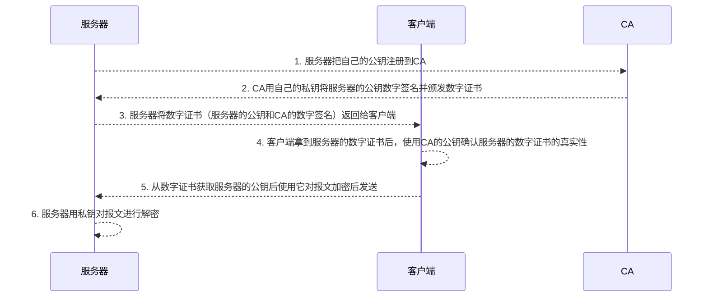

## HTTP 是什么？
HTTP 是超文本传输协议，也就是HyperText Transfer Protocol。`HTTP 是一个在计算机世界里专门在「两点」之间「传输」文字、图片、音频、视频等「超文本」数据的「约定和规范」。`  

##常见的状态码有哪些？
`1xx` 属于提示信息，是协议处理中的一种中间状态，还需要后续的操作
`2xx` 表示服务器成功处理了客户端的请求
`3xx` 表示重定向「301 Moved Permanently」表示永久重定向/「302 Found」表示临时重定向 / 「304 Not Modified」
`4xx` 表示客户端发送的报文有误，服务器无法处理 「400 Bad Request」/「403 Forbidden」/ 「404 Not Found」
`5xx` 服务器处理时内部发生了错误 「500 Internal Server Error」/ 「502 Bad Gateway」/ 「503 Service Unavailable」

## 常见字段有哪些？
请求字段:`Accept` / `Accept-Encoding` / `Accept-Language` / `Authorizatio`n / `Cache-Control` / `Connection` / `Content-Length` /` Content-Type` / `Cookie` / `Host` / `Origin` / `Refer` / `User-Agent`
响应字段：`Access-Control-Allow-Origin` / `Cache-Control` / `Content-Encoding` / `Content-Length` / `Content-Type` / `Date` / `ETag` / `Expires` / `Last-Modified` / `Location` / `Server` / `Set-Cookie `

## `GET`和`POST`的区别
**用途**：GET获取资源，POST提交信息
**参数传递**：GET在URL上长度受限，POST通过body基本不受限
**缓存**：GET可配缓存，POST不可以
**幂等性**：GET幂等，POST不幂等；GET相对服务器安全
`GET` 的语义是请求获取指定的资源。GET 方法是安全、幂等、可被缓存的。
`POST` 的语义是根据请求负荷（报文主体）对指定的资源做出处理，具体的处理方式视资源类型而不同。POST 不安全，不幂等，（大部分实现）不可缓存。

## HTTP缓存
HTTP 缓存有两种实现方式，分别是**强制缓存**和**协商缓存**。
`强制缓存`: 缓存没有过期，则直接使用浏览器的本地缓存(200： from disk cache)，实现：
>`Cache-Control`: maxage=xxx //一个相对时间
>`Expires`: 一个绝对时间
>*`Cache-Control` 的优先级高于` Expires`*

`协商缓存`: 与服务端协商之后，通过协商结果来判断是否使用本地缓存。两种实现
>1. 请求头部中的 `If-Modified-Since` 与响应头部中的 `Last-Modified`
>2. 请求头部中的 `If-None-Match` 与响应头部中的 `ETag`
>*`Etag` 的优先级更高：1.**精确性**（ETag针对资源内容，Last-Modified基于时间，秒级的，两种情况：时间变了，内容没变；内容变了时间没变，1s内多次修改）；2.**灵活性**：服务器可以根据实际需求生成 Etag，例如可以考虑资源内容、元数据等因素。这使得 Etag 能够更好地适应不同场景。而 Last-Modified 仅依赖于资源的修改时间，适用性相对较差；3.**弱验证**：Etag 支持弱验证（W/ 前缀），这意味着即使资源发生了细微变化（如元数据变化），服务器也可以将其视为相同的资源。这有助于进一步提高缓存的命中率。而 Last-Modified 不支持弱验证，只能根据修改时间进行判断*

***注意，协商缓存这两个字段都需要配合强制缓存中 Cache-Control 字段来使用，只有在未能命中强制缓存的时候，才能发起带有协商缓存字段的请求。***

## HTTPS
+ HTTP信息是明文传输，存在安全风险的问题。HTTPS 则在 TCP 和 HTTP 网络层之间加入了 `SSL/TLS` 安全协议，使得报文能够加密传输。
+ HTTPS 在 TCP 三次握手之后，还需进行 `SSL/TLS` 的握手过程，才可进入加密报文传输。
+ HTTP 默认端口号是 80，HTTPS 默认端口号是 443。
+ HTTPS 协议需要向 CA（证书权威机构）申请数字证书，**来保证服务器的身份是可信的**。
数字证书工作流程：

*CA的公钥事先已经置入到浏览器或者操作系统里了*

SSL（Secure Sockets Layer，安全套接层）和 TLS（Transport Layer Security，传输层安全）是一组用于保护网络通信安全和隐私的加密协议。SSL 是较早的版本，已被 TLS 取代，但在实际使用中，人们通常将两者统称为 SSL/TLS。

SSL/TLS 协议基本流程：
- 客户端向服务器索要并验证服务器的公钥。
- 双方协商生产「会话秘钥」。
- 双方采用「会话秘钥」进行加密通信。

## HTTP/1.1、HTTP/2、HTTP/3 演变
- HTTP1.1: 长连接（持久链接`Connection: keep-alive`） / 管道传输（一个请求发送后，不用等待其回来。一次可以发起多个请求）

- HTTP1.1的主要缺陷：队头阻塞 / 只能由客户端发起请求 / 请求/响应报文的头部信息冗余 / 报文数据不强制压缩，导致传输量大

- HTTP2.0: 基于HTTPS，改进：
  - `头部压缩`: `HPACK`算法，在客户端和服务器同时维护一张头信息表，所有字段都会存入这个表，生成一个索引号，以后就不发送同样字段了，只发送索引号，这样就提高速度了
  - `二进制格式传输`: 头信息和数据体都是二进制,增加了数据传输的效率。
  - `多路复用`: 每个请求/响应都可以看作一个流(stream)，并给每个stream分配id，一个TCP连接上可以有多个stream，stream中的帧都是乱序的，到对端后再根据帧的stream_id重新组装，这样可以避免队首阻塞问题，极大地提高传输性能
  - `服务器主动推送`

- HTTP3.0: TCP替换为UDP解决队头阻塞问题，在 UDP 协议上开发了 `QUIC` 协议保证数据的可靠传输,该协议的特点：无队头阻塞 / 建立连接速度快 / 连接迁移时“无缝”地复用原连接

*队头阻塞：如果序列号较低的 TCP 段在网络传输中丢失了，即使序列号较高的 TCP 段已经被接收了，应用层也无法从内核中读取到这部分数据，从 HTTP 视角看，就是多个请求被阻塞了；*

## 短轮询和长轮询
短轮询（Short Polling）和长轮询（Long Polling）是两种客户端与服务器进行实时通信的技术。它们主要用于在客户端获取服务器上的实时更新信息，例如聊天应用、实时股票行情等场景。

**短轮询（Short Polling）**

短轮询是一种简单的实时通信技术。客户端以固定的时间间隔向服务器发送请求，以获取新的信息。具体流程如下：

1. 客户端向服务器发送请求，询问是否有新的信息。
2. 服务器接收到请求后，立即返回当前可用的信息。
3. 客户端处理服务器返回的信息，并在一段时间后再次发送请求。

短轮询的优点是实现简单，兼容性好。但它存在以下缺点：

1. 频繁的请求会给服务器带来较大的压力。
2. 由于固定的时间间隔，客户端获取到新信息的实时性受到限制。

**长轮询（Long Polling）**

长轮询是一种改进的实时通信技术，它在短轮询的基础上引入了一种等待机制，以减少请求的频率和延迟。具体流程如下：

1. 客户端向服务器发送请求，询问是否有新的信息。
2. 服务器接收到请求后，如果有新的信息，则立即返回；如果没有新的信息，则保持连接，直到有新的信息时再返回。
3. 客户端处理服务器返回的信息，并立即发送新的请求。

长轮询的优点是减少了请求的频率，提高了获取新信息的实时性。但它仍然存在以下缺点：

1. 服务器需要为每个客户端维持一个长连接，消耗较多的资源。
2. 当服务器的新信息产生速度较快时，长轮询可能退化为短轮询。

总之，短轮询和长轮询都是实现客户端与服务器实时通信的技术，它们各有优缺点。在实际应用中，还可以考虑使用其他技术，如 WebSocket、Server-Sent Events 等，以满足不同的需求。
